# CS102 ~ Design Project ~ Spring 2019/20
[Computer Engineering Department, Bilkent University](http://w3.cs.bilkent.edu.tr/en/).  
The information and code in this repository are submitted in partial fulfillment of the CS102 Semester Design Project. Except where explicitly stated, the work is that of the group members listed below (who are expected to follow ethical academic & professional practice).
****
## g2I ~~ Pictureit ~~
****

## Project Description
*This project is a mobile app that tries to make children go outside. The app gives several photo quests to children, and kids try to find those objects/tasks.*

**Home Screen**  
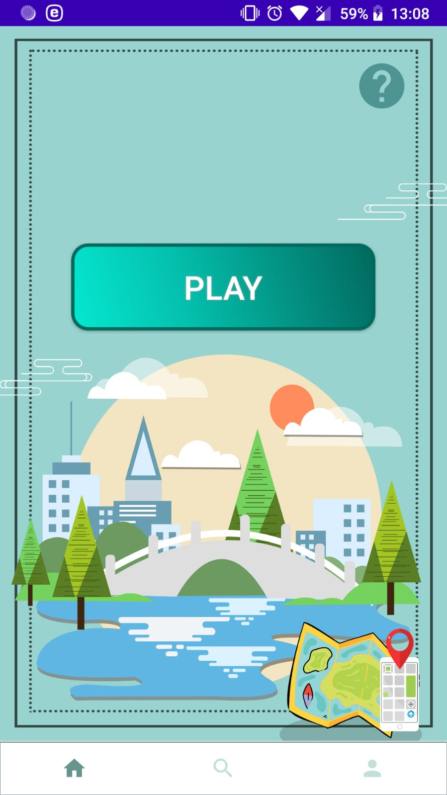

**Play Screen**  
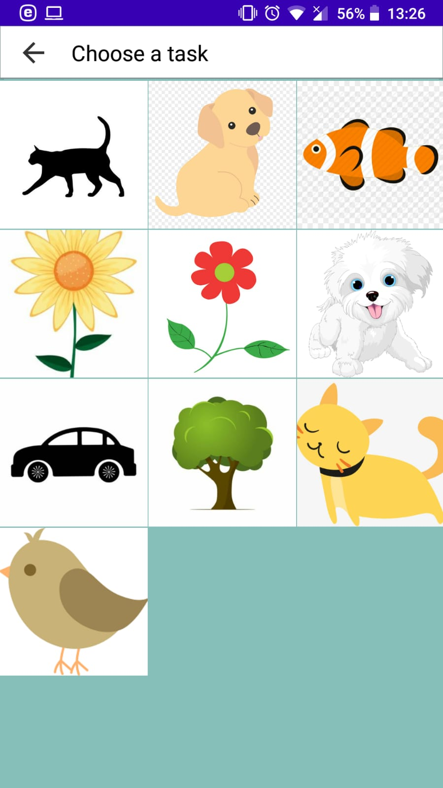
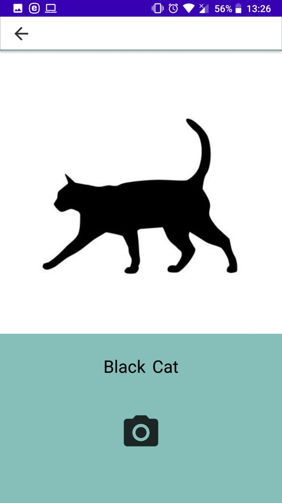

**Search Screen**  
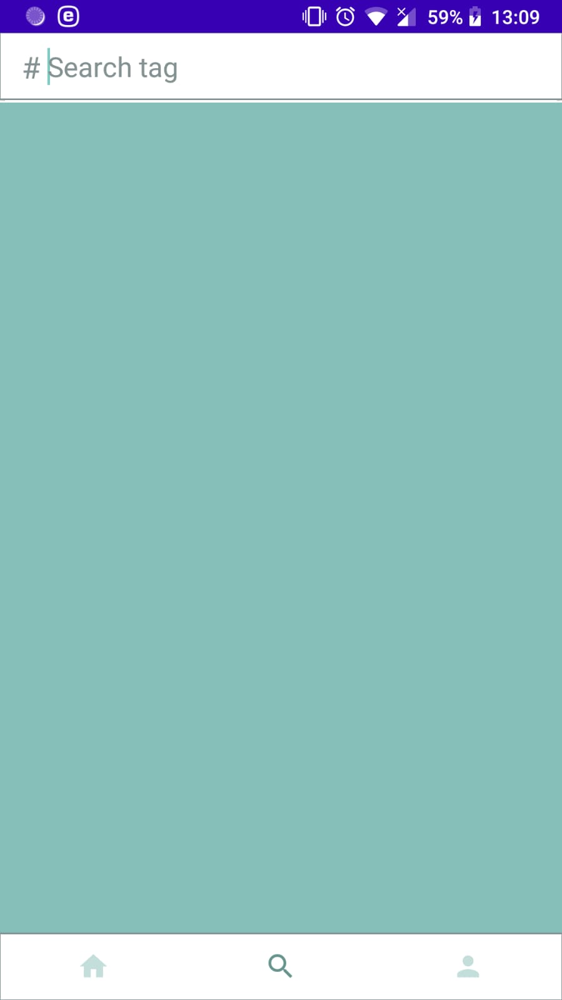
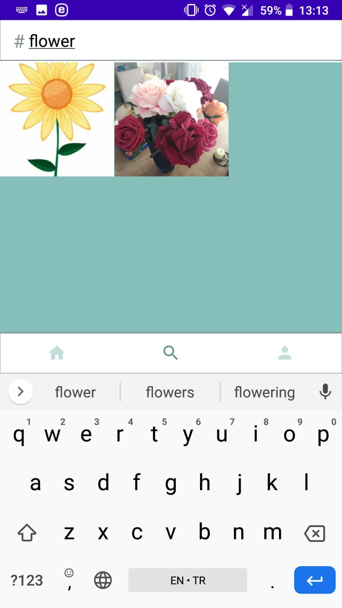
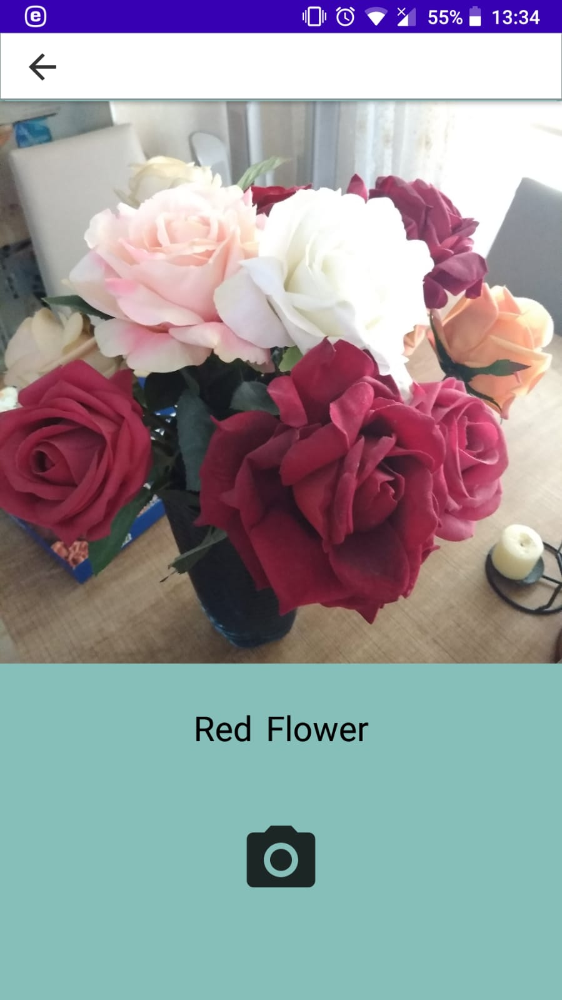

**Profile Screen**  
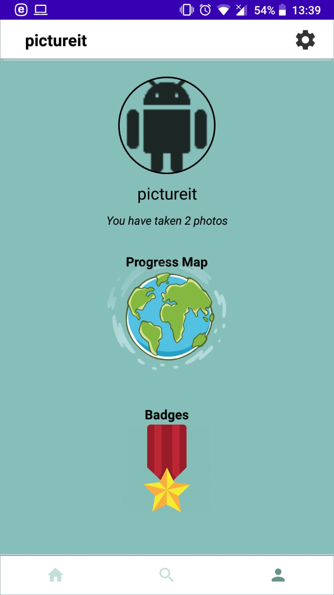

**Progress Map Section**  
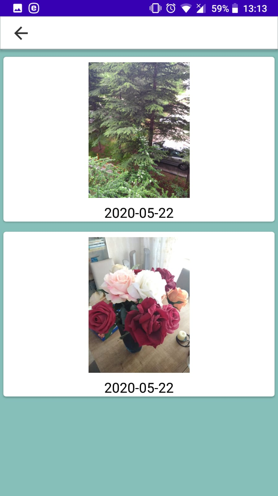

**Badges Section**  
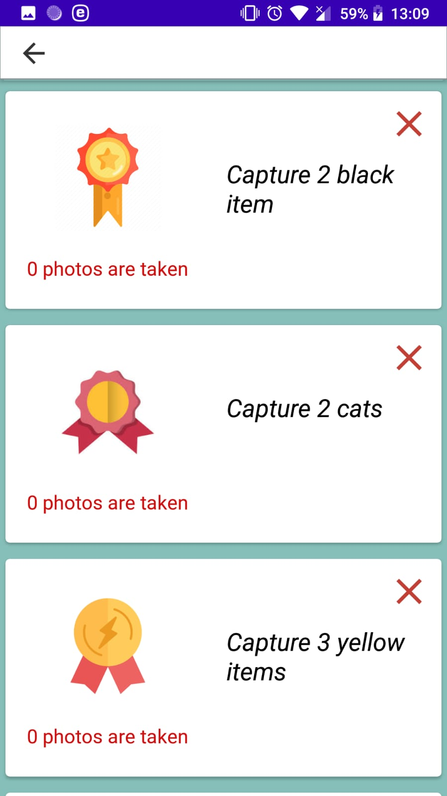

**Settings Section**  
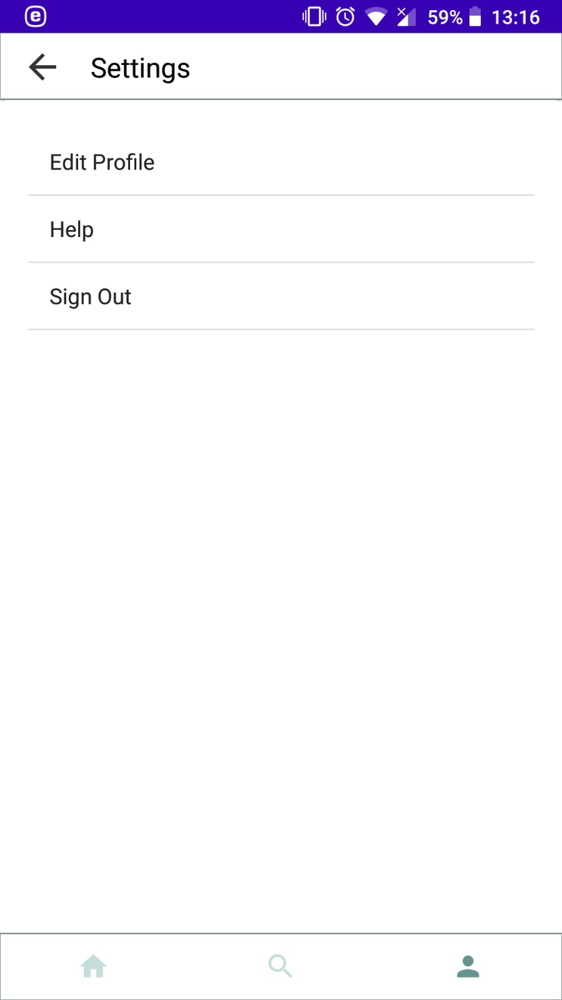

**Edit Profile Section**  
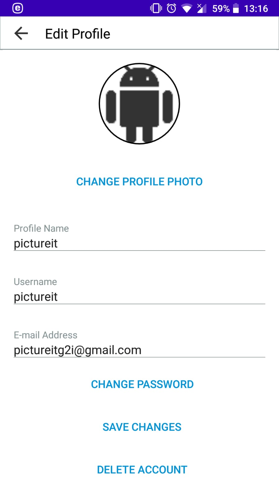

**Help Section**  
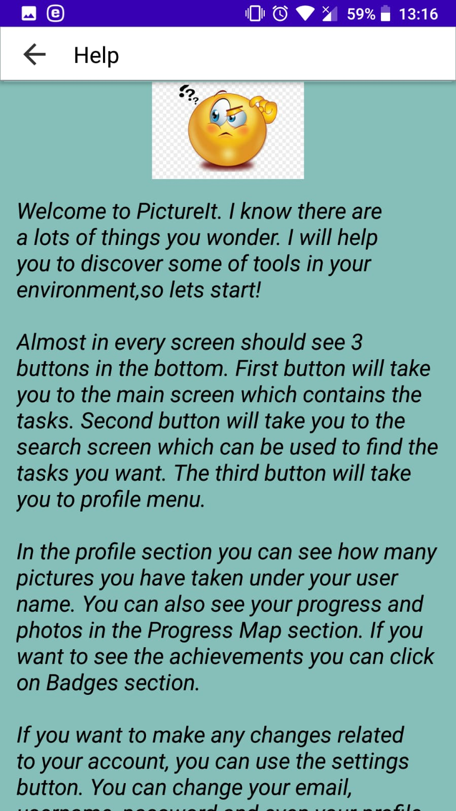

**Signout**  

   
## Project Status
+ **Group/project Selection:** completed (12/02/2020)
+ **Requirements:** completed (24/02/2020)
+ **UI Design:** completed (07/03/2020)
+ **Detailed Design:** completed (13/05/2020)
+ **Implementation:** completed (20/05/2020)
+ **Reflections:** not yet!

[Group Meetings Log](group/meetingslog.md)
#### Group Members
Ahmed Salih Cezayir 21802918
İsmail Sergen Göçmen 21903707
Cemal Faruk Güney   21903474
Mehmet Ali Öztürk 21703425

****
**Instructor:** _DavidDavenport_   **TA:**  _AtakanSerbes_
****
